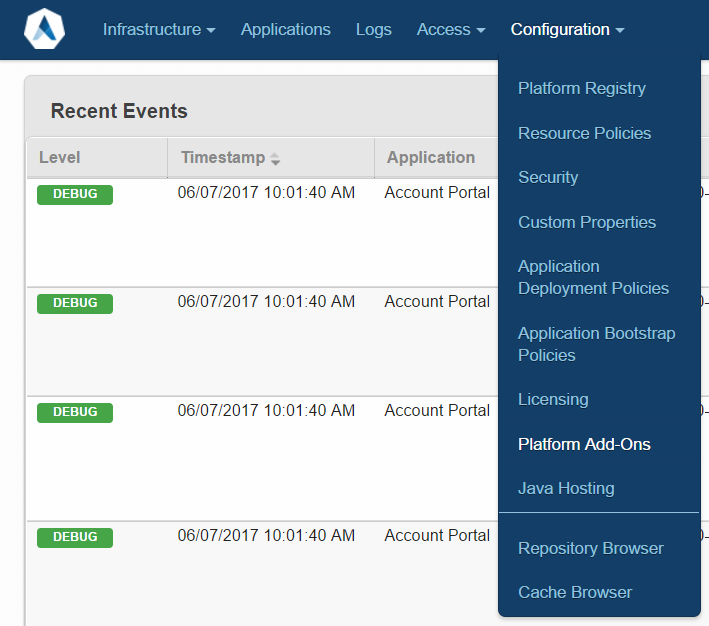
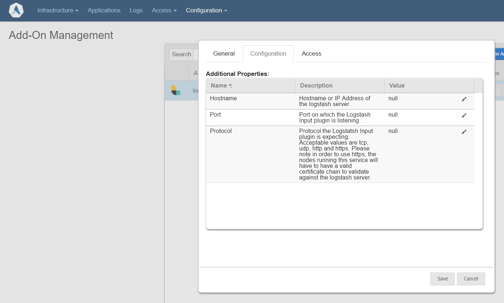
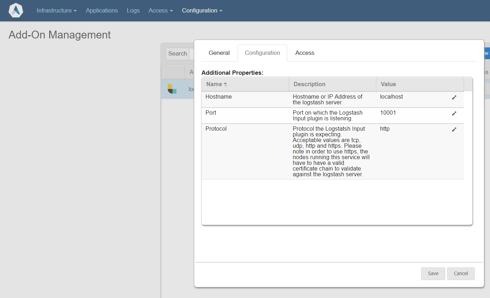
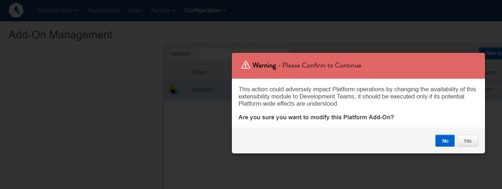
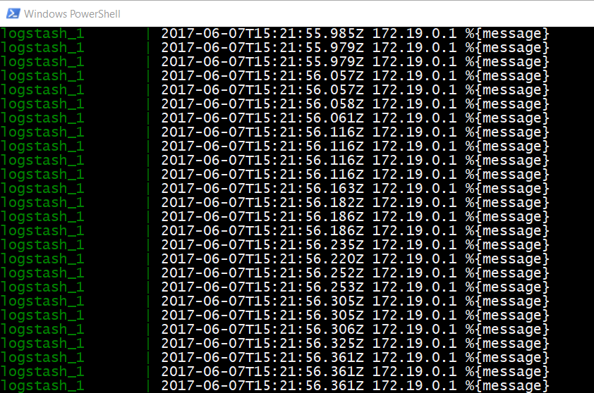

# Apprenda Logstash Publisher
This application represents a possible solution to publish apprenda logs to 
logstash.  It is based on guidance [provided by Apprenda for integrating with Splunk](https://github.com/Apprenda/Splunk).

# What is it?
This product is two components that run on the Apprenda Platform.  The first is an [Apprenda Platform Add-On](http://docs.apprenda.com/current/addons), that manages connection information for development teams to connect to an external Logstash instance.  The second is a [Apprenda log aggregator extension](http://docs.apprenda.com/current/extensions), that is responsible for receving logs from the Apprenda Platform and forwarding them to logstash via connection information provided by the aformentioned add-on.

## A note about Audit Logs
[Apprenda Audit Logs](http://docs.apprenda.com/7-0/managing-event-logs#Audit%20Logs) are note currently supported by the log forwarder extension.  In order to aggregate these logs into Logstash, it's suggested that you use the [Logstash jdbc input plugin](https://www.elastic.co/guide/en/logstash/current/plugins-inputs-jdbc.html) attached to the dbo.AuditLog table in the ```Apprenda Auditing``` database.

# Building the source
## Prerequisites
### Automatic Installation

<div style="border: solid 1px red; background-color: #ffe6e6; color: black; padding: 10px">
<h4>Warning</h4>
You must run this from a Powershell window with administrative privleges.  Also, be sure that your <a href="https://msdn.microsoft.com/en-us/powershell/reference/5.1/microsoft.powershell.core/about/about_execution_policies">execution policy</a> is not overly restrictive to build the code.  Bypass execution policy is sufficient to work with this product.

Also, the test scripts in the product leverage Docker and has been tested with Docker for Windows.  This version of docker has [signficant installation requirements](https://docs.docker.com/docker-for-windows/install/#what-to-know-before-you-install).  This product may also be used with the legacy desktop solution, [Docker Toolbox](https://docs.docker.com/toolbox/overview/), but that configuration is not covered in this document.
</div>

You may build and install prerequisites by hand or use the provided script in [tools/Install-Prerequisites.ps1](tools/Install-Prerequisites.ps1)

This script will:
* Download and install the Apprenda SDK if it's not installed.
* Download the [prerequisite powershell library](https://github.com/jasonvanbrackel/powershell)
* Install the preprequisite powershell library as Powershell-JvB
* Import the Powershell-JvB module into the current powershell session.
* Install [chocolatey](https://chocolatey.org) if it's not installed
* Install [MsBuild via chocolatey](https://chocolatey.org/packages/microsoft-build-tools)
* Install [Docker for Windows via chocolatey](https://chocolatey.org/packages/docker-for-windows)  or Install [Docker Toolbox via chocolatey](https://chocolatey.org/packages/docker-toolbox)


```powershell
# From the working directory
Set-ExecutionPolicy -Scope Process -ExecutionPolicy Bypass
.tools/Install-Prerequisites.ps1
```

### Apprenda SDK
The [Apprenda SDK](https://docs.apprenda.com/downloads#tools) is a dependency to build this project.

### Powershell Library
The build scripts developed for this application rely upon the powershell library available at [https://github.com/jasonvanbrackel/powershell](https://github.com/jasonvanbrackel/powershell).  

### MSBuild 
[MSBuild](https://github.com/Microsoft/msbuild) is used by the scripts to build the various Visual Studio Solution files.

### Docker
[Docker](https://www.docker.com) and [Docker Compose](https://github.com/docker/compose) are used to test the log forwarding service to standup a local [Elastic Stack](https://www.elastic.co/products) for testing.

## Building
Once the prerequisites are installed. Run the [tools/BuildAndPackage-LogForwardingComponents.ps1](tools/BuildAndPackage-LogForwardingComponents.ps1) script.

```powershell
.tools/BuildAndPackage-LogForwardingComponents.ps1
```

This will create logstashforwarder.zip and logstashAddOn.zip archives in this folder.

# Installation
## Log Forwarding Extension Service and Logstash AddOn
In order to install and test the binaries you will need an Apprenda Platform (version 6.7 or later) available that is able to communicate to the test Elastic Stack.  [Installation of the Apprenda Platform](http://docs.apprenda.com/current/download) is outside of the scope of this document.

1. Build the log forwarder extension service application and logstash addon archives per the instructions above.
2. Deploy the logstash log forwarding extension and the logstash add-on using the [tools/Deploy-LogForwardingComponents.ps1](tools/Deploy-LogForwardingComponents.ps1) script.
3. Log into the platform SOC and set the logstash connection properties for the logstash add-on.  The instructions for doing so are at the end of the Deploy-LogForwardingComponents.ps1 and are covered later in this document.
4. Provision and instance of the add-on and promote the log forwarding extension using the [tools/Promote-LogForwardingComponents.ps1](tools/Promote-LogForwardingComponents.ps1) script.

```powershell
$apprendaCredentials = Get-Credential
$configuration = "Debug"
$platformUrl = "https://yourplatform/"
$tenant = "YourTenant"
.\tools\BuildAndPackage-LogForwardingComponents.ps1 -Configuration $configuration
.\tools\Deploy-LogForwardingComponents.ps1 -PlatformUrl $platformUrl -Username $apprendaCredentials.UserName -Password $apprendaCredentials.GetNetworkCredential().Password -Tenant $tenant
.\tools\Promote-LogForwardingComponents.ps1
```

## Setting up the logstash add-on connection properties
Currently (as of Apprenda Cloud Platform 7.0) the [Platform Operations API](http://docs.apprenda.com/restapi/platformops/v1) does not support the setting of Properties to configure add-ons via automation.  Therefore, an operator is required to setup the properties of the Logstash Add-On

1. Navigate to the SOC via https://yourplatform/SOC.
2. Select Configuration > Platfom Add-Ons.

3. For the logstash Add-On click the Edit button.

4. Click on the Configuration Tab

5. For each property, you need to set the value.  To do so click on the pencil icon next to each property.

6. Set the property and click OK.  You'll do this for Hostname, Port and Protocol

7. Once all the properties are set hit Save.

8. Click Yes to confirm that you do want to modify the Platform Add-On.

9. The Add-On is now ready for developers to consume.


## Logstash Setup
Your logstash configuration will need an input for http.  Https is acceptable as long as the the Apprenda logstash Add-On has been configured to use https and the full certificate chain of trust is verifyable.  Here is the example from the [tools/docker/logstash/pipeline/logstash.conf](tools/docker/logstash/pipeline/logstash.conf) file used for testing this product.

```
input {
    http {
        codec => "json"
        host => "0.0.0.0"
        id => "apprenda_http_input"
        port => 10001
        ssl => "false"
        verify_mode => "none"
    }
}
```

# Testing the code
[Setting up logstash in docker](https://www.elastic.co/guide/en/logstash/current/docker.html) goes beyond the scope of this document.  [tools/Test-LogForwardingService.ps1](tools/Test-LogForwardingService.ps1) can be used to run a test of the code.  As with installing the logstash add-on, there is a manual step of setting up the add-on properties.

The test code will start up an Elastic(ELK) stack in a Powershell Job and will send forward logs to Logstash, while watching the console output of the various components in the stack.

```powershell
$apprendaCredentials = Get-Credential
$configuration = "Debug"
$platformUrl = "https://yourplatform/"
$tenant = "YourTenant"
.\tools\Test-LogForwardingService.ps1 -Configuration $configuration -Step 1 -PlatformUrl $platformUrl -Username $apprendaCredentials.UserName -Password $apprendaCredentials.GetNetworkCredential().Password -Tenant $tenant
.\tools\Test-LogForwardingService.ps1 -Configuration $configuration -Step 2 -PlatformUrl $platformUrl -Username $apprendaCredentials.UserName -Password $apprendaCredentials.GetNetworkCredential().Password -Tenant $tenant
```

When the test is successful, you will see messages like this coming from logstash.


To stop the test type Ctrl-C, then stop the "ELK Job" Powershell job.
```
logstash_1       | 2017-06-07T16:04:41.515Z 172.19.0.1 %{message}
logstash_1       | 2017-06-07T16:04:41.515Z 172.19.0.1 %{message}
logstash_1       | 2017-06-07T16:04:41.558Z 172.19.0.1 %{message}
```
```powershell
^C
Get-Job 'ELK Job' | Stop-Job
Remove-Job 'ELK Job'
```